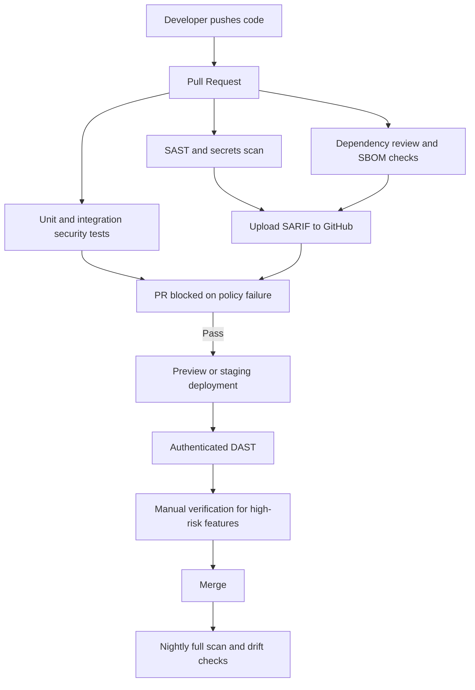
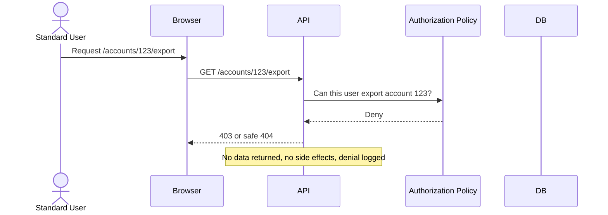
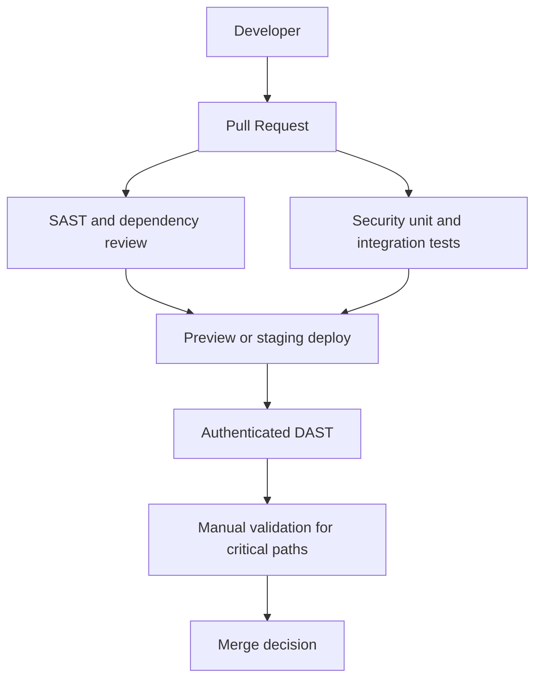
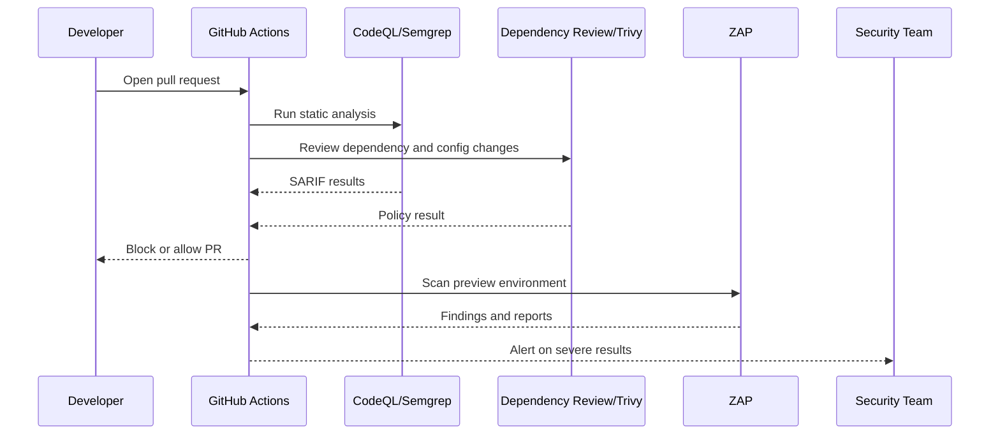
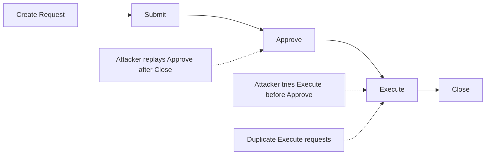

# Comprehensive GitHub README Testing Guide for the OWASP Top Ten 2025

## Executive Summary

OWASP’s current Top Ten release is the Twenty Twenty-Five edition. It keeps **Broken Access Control** at the top, moves **Security Misconfiguration** to second, expands older “vulnerable components” concerns into **Software Supply Chain Failures**, and adds **Mishandling of Exceptional Conditions** as a new category. OWASP says the Twenty Twenty-Five effort is “data-informed, but not blindly data-driven,” and that the release analyzed data from more than **two point eight million** applications, spanning **two hundred forty-eight CWEs** across the ten categories. OWASP also states that two categories were promoted through the community survey to account for risks that may be underrepresented in scanner data. 
The recommended default priority profile for a first implementation is:

| Category | Recommended default priority | Why this is a sensible default |
|---|---:|---|
| Broken Access Control | Critical | Ranked first by OWASP and commonly leads to direct unauthorized data access or action execution |
| Security Misconfiguration | High | Extremely prevalent and often easy to exploit at scale |
| Software Supply Chain Failures | Critical | High exploit and impact potential; remediation often requires process changes |
| Cryptographic Failures | High | Can expose secrets, sessions, and regulated data |
| Injection | Critical | Includes SQLi, command injection, and XSS-class issues with high attacker leverage |
| Insecure Design | High | Often systemic and expensive if found late |
| Authentication Failures | High | Direct path to account takeover or privilege access |
| Software or Data Integrity Failures | High | Commonly affects update trust, deserialization, and artifact integrity |
| Security Logging and Alerting Failures | Medium to High | Often not the initial compromise vector, but deeply increases dwell time and incident cost |
| Mishandling of Exceptional Conditions | Medium to High | Frequently becomes info disclosure, fail-open authorization, or availability loss |

That matrix is an editorial recommendation derived from OWASP’s ranking and descriptions, and it should be refined per finding with CVSS v4.0 and environmental modifiers.

## Research Basis and Design Principles

This guide should be built around official OWASP material first. The primary source is the **OWASP Top Ten Twenty Twenty-Five** release and its category pages. The strongest companion documents are the **WSTG**, **ASVS Five Point Zero**, and the **OWASP Cheat Sheet Series**. For CI/CD and supply-chain sections, the most authoritative modern complements are **NIST SP Eight Hundred Eighteen**, **CISA Secure by Design**, **CycloneDX**, and **SLSA**. For GitHub implementation details, use **GitHub Docs**, plus official tool documentation for **ZAP**, **CodeQL**, **Burp**, **Semgrep**, **Trivy**, and **OWASP Dependency-Check**.

A disciplined README should treat testing as a **layered system**, not a single scanner run:

| Layer | Purpose | Best examples |
|---|---|---|
| Manual security testing | Finds logic flaws, edge cases, and contextual authorization issues | Burp Repeater, Burp Intruder, browser DevTools, curl |
| DAST | Finds runtime weaknesses in exposed behavior | ZAP baseline, ZAP full, Burp Scanner, authenticated API scans |
| SAST | Finds code-level patterns before runtime | CodeQL, Semgrep |
| SCA and supply-chain controls | Detect vulnerable or untrusted components and build weaknesses | Dependency Review, Dependency-Check, Trivy, SBOM generation |
| Security unit and integration tests | Prevent regressions in authz, workflow, and validation | Language-native tests, API contract tests |
| Operational validation | Confirms logs, alerts, and safe failure | Log assertions, alert pipeline verification, chaos or fault injection |

That layered approach aligns closely with OWASP’s WSTG scope, ASVS verification model, and NIST’s recommendation to embed secure software practices throughout the SDLC rather than treat security as a final-stage check.

For GitHub presentation, Mermaid is worth using because GitHub supports Mermaid diagrams inside fenced code blocks, and GitHub also supports collapsible `<details>` sections for keeping long READMEs readable.

Below is a Mermaid diagram that works well near the beginning of the README to explain the intended testing flow.



A second useful diagram is a sequence diagram for access-control verification, because access-control bugs remain the most important category in the latest OWASP release. 



## GitHub README Template

The template below is ready to paste into a `README.md`. It uses badges, a table of contents, contribution guidance, Mermaid placeholders, and collapsible sections so the file stays usable even when it grows large. GitHub supports Markdown rendering, Mermaid diagrams, and `<details>` sections, so all of these elements are appropriate for a GitHub-native guide. 

```md
# OWASP Top 10 2025 Web Application Testing Guide

[](./SECURITY.md)
[](./LICENSE)
[](./.github/workflows)
[](https://docs.github.com/en/code-security)
[](https://owasp.org/Top10/2025/)

> A framework-agnostic, test-first guide for assessing web applications against the OWASP Top 10 2025, with manual techniques, automation patterns, CI/CD workflows, and remediation guidance.

## Table of Contents

- [Purpose](#purpose)
- [Audience](#audience)
- [Scope](#scope)
- [Methodology](#methodology)
- [Risk Scoring](#risk-scoring)
- [Tooling](#tooling)
- [Testing Playbooks](#testing-playbooks)
  - [Broken Access Control](#broken-access-control)
  - [Security Misconfiguration](#security-misconfiguration)
  - [Software Supply Chain Failures](#software-supply-chain-failures)
  - [Cryptographic Failures](#cryptographic-failures)
  - [Injection](#injection)
  - [Insecure Design](#insecure-design)
  - [Authentication Failures](#authentication-failures)
  - [Software or Data Integrity Failures](#software-or-data-integrity-failures)
  - [Security Logging and Alerting Failures](#security-logging-and-alerting-failures)
  - [Mishandling of Exceptional Conditions](#mishandling-of-exceptional-conditions)
- [CI and Automation](#ci-and-automation)
- [Quick Audit Checklist](#quick-audit-checklist)
- [References](#references)
- [Contributing](#contributing)

## Purpose

This repository documents repeatable testing guidance for the OWASP Top 10 2025, with:
- manual tests
- DAST and SAST examples
- example curl, Burp, ZAP, Semgrep, CodeQL, Trivy, and Dependency-Check usage
- remediation guidance
- CI/CD integration patterns
- evidence templates for findings

## Audience

Security engineers, application developers, reviewers, and platform teams with intermediate knowledge of web application security.

## Scope

- Web apps
- APIs
- Authentication and authorization flows
- CI/CD and software supply chain controls
- Runtime observability for security events

## Methodology

This guide uses:
- OWASP Top 10 2025 as the risk taxonomy
- OWASP WSTG for test ideas
- OWASP ASVS for verification objectives
- OWASP Cheat Sheet Series for implementation and remediation patterns
- GitHub-native CI/CD examples for continuous enforcement

## Risk Scoring

Use:
- category priority from OWASP Top 10 2025
- CVSS v4.0 for individual findings
- environmental context for data sensitivity, exposure, and exploitability

## Tooling

| Tool | Primary Use | Notes |
|---|---|---|
| Burp Suite | Manual testing, proxying, repeater, scanner | Best for deep manual validation |
| OWASP ZAP | DAST | Strong for CI/CD and API scans |
| CodeQL | SAST | Good for variant analysis and SARIF |
| Semgrep | SAST | Fast feedback, custom rules |
| Trivy | SCA, misconfig, secrets | Good CI and SARIF support |
| Dependency-Check | Known vulnerable dependencies | Strong for Java and build ecosystems |

## Architecture and Flow



## Testing Playbooks

### Broken Access Control

<!-- include background, attack scenarios, testing steps, automated checks, remediation -->

### Security Misconfiguration

<!-- include hardening, headers, default creds, XXE, debug paths, drift -->

### Software Supply Chain Failures

<!-- include SCA, SBOM, provenance, package policies, CI controls -->

### Cryptographic Failures

<!-- include TLS, token quality, key handling, data-at-rest checks -->

### Injection

<!-- include SQLi, NoSQLi, command injection, XSS, template injection -->

### Insecure Design

<!-- include abuse cases, state machines, workflow, rate and business limits -->

### Authentication Failures

<!-- include login, reset, MFA, session management, enumeration -->

### Software or Data Integrity Failures

<!-- include deserialization, signature validation, update trust, webhooks -->

### Security Logging and Alerting Failures

<!-- include event taxonomy, log integrity, alert paths, signal quality -->

### Mishandling of Exceptional Conditions

<!-- include fail-secure behavior, malformed input, nulls, timeouts, resource errors -->

## CI and Automation

Place workflow examples in:
- `.github/workflows/codeql.yml`
- `.github/workflows/dependency-review.yml`
- `.github/workflows/zap-baseline.yml`
- `.github/workflows/nightly-zap-full.yml`

## Quick Audit Checklist

- [ ] Authorization enforced server-side for every sensitive action
- [ ] Security headers and hardening baselines applied
- [ ] Dependency changes reviewed and blocked on policy
- [ ] TLS and secret handling reviewed
- [ ] Injection sinks covered by tests and parameterization
- [ ] Abuse cases documented for critical flows
- [ ] MFA, reset, logout, and session invalidation tested
- [ ] Artifact and data integrity checks enforced
- [ ] Logs capture high-value events without leaking secrets
- [ ] Error handling fails securely and does not disclose internals

## References

Use official sources first:
- OWASP Top 10 2025
- OWASP WSTG
- OWASP ASVS
- OWASP Cheat Sheet Series
- NIST SSDF
- CISA Secure by Design
- GitHub Actions and Code Security documentation

## Contributing

We welcome:
- rule improvements
- new CI examples
- language-specific remediations
- corrections to mapped test cases
- better Mermaid diagrams and evidence templates

### Contribution Rules

1. Prefer official OWASP, NIST, CISA, GitHub, or vendor-primary documentation.
2. Add citations for factual claims and tool behavior.
3. Include “expected result” and “remediation” for every new test case.
4. Keep examples legal, defensive, and suitable for owned test environments only.
5. For tool examples, include version assumptions where relevant.

### Pull Request Checklist

- [ ] References are authoritative
- [ ] Markdown renders correctly on GitHub
- [ ] Mermaid diagrams render on GitHub
- [ ] Code samples are framework-agnostic or clearly labeled
- [ ] New checks are aligned to an OWASP Top 10 category
```

## Detailed Testing Playbooks

The most effective way to write the long-form README is to keep each category section structurally consistent: **background**, **representative attack scenarios**, **manual detection**, **automated detection**, **sample commands**, **test cases with expected results**, **remediation**, and **references**. That consistency makes the document easier to browse and helps contributors extend it without drift. OWASP category pages, WSTG sections, and ASVS requirements are the best anchors for that pattern.

### Broken Access Control

**OWASP identifier:** A01:2025. OWASP keeps Broken Access Control at the top position and says all tested applications in the contributed dataset showed some form of this problem. The category explicitly includes IDOR-style issues, missing method-level checks, CORS misconfiguration abuse, token or metadata tampering, force browsing, and SSRF through the Twenty Twenty-Five consolidation.

The most realistic attack scenarios are usually straightforward: a standard user changes an object identifier and gains access to another tenant’s records; a user can call privileged `POST`, `PUT`, or `DELETE` endpoints because the UI hid the function but the server did not enforce it; or a same-site browser request succeeds without a valid CSRF defense. For APIs, test both **horizontal access** and **vertical access**. For server-side fetch features, also treat outbound request capability as an access-control concern, because OWASP now maps SSRF into this category.

Manual detection should begin with a **role-resource matrix**: list roles, list sensitive objects, then replay the same request as every lower-privileged role. Burp Repeater is ideal here because it allows one-request-at-a-time differential analysis, while Intruder is useful for safe object-ID enumeration in a controlled environment. The WSTG authorization section is the formal manual-testing anchor; OWASP’s Authorization Cheat Sheet and SSRF Prevention Cheat Sheet provide the prevention model to compare against.

Automated coverage should include authenticated DAST, API contract and integration tests that assert forbidden access, and regression tests around every route that mutates data or reveals one user’s records. ZAP API Scan is useful for API definitions because it imports OpenAPI, SOAP, or GraphQL descriptions and actively scans discovered endpoints. Burp Scanner and CodeQL can complement runtime testing, but neither replaces explicit **authorization regression tests** in the app test suite.

**Sample commands**

```bash
# Horizontal access test: same endpoint, different object id
curl -i -H "Authorization: Bearer $USER_TOKEN" \
  https://app.example.test/api/invoices/1001

curl -i -H "Authorization: Bearer $USER_TOKEN" \
  https://app.example.test/api/invoices/1002

# Method-level authorization test
curl -i -X DELETE -H "Authorization: Bearer $USER_TOKEN" \
  https://app.example.test/api/admin/users/42

# CORS sanity check
curl -i -H "Origin: https://evil.example.test" \
  -H "Authorization: Bearer $USER_TOKEN" \
  https://app.example.test/api/profile

# CSRF validation on state-changing route
curl -i -X POST \
  -H "Cookie: session=$SESSION" \
  -H "Content-Type: application/json" \
  -d '{"email":"changed@example.test"}' \
  https://app.example.test/account/profile
```

**Node.js authorization example**

```js
// Express-style server-side record ownership check
app.get("/api/projects/:id", authenticate, async (req, res) => {
  const project = await projectRepo.findById(req.params.id);

  if (!project) {
    return res.sendStatus(404);
  }

  const allowed =
    req.user.roles.includes("admin") || project.ownerId === req.user.id;

  if (!allowed) {
    audit.warn("authz_denied", {
      userId: req.user.id,
      projectId: req.params.id,
      action: "read_project"
    });
    return res.sendStatus(403);
  }

  return res.json(project);
});
```

**Representative test cases**

| Test case | Technique | Expected secure result |
|---|---|---|
| Change object ID from own to another user’s | Repeater or curl | `403` or safe `404`; no foreign data |
| Invoke admin-only route as standard user | Direct request | Denied server-side regardless of UI visibility |
| Remove CSRF token from state-changing request | Browser or curl | Request rejected consistently |
| Replay expired JWT or logged-out session | curl or integration test | Token rejected, session invalidated |
| Change CORS `Origin` to untrusted site | curl | Server does not allow credentialed cross-origin access |

Remediation should be centralized and server-side: deny by default, enforce record ownership in domain logic, keep authorization checks out of the client, minimize CORS, invalidate stateful sessions on logout, keep stateless tokens short-lived, and log repeated denials as security signals. OWASP specifically recommends reusable access-control mechanisms, domain-model enforcement for ownership, and testing authorization inside unit and integration suites.

### Security Misconfiguration

**OWASP identifier:** A02:2025. OWASP moved Security Misconfiguration from fifth to second. The category page emphasizes that modern software is increasingly configuration-driven and that insecure defaults, unnecessary features, unchanged default accounts, verbose errors, and disabled security features are common roots of exposure. XXE remains one of the notable mapped weaknesses in this category.

This category is where many “easy wins” appear. Typical attack scenarios include an exposed admin console, directory listing, default credentials, permissive CORS, debug or stack-trace disclosure, `.git` or backup files under the web root, disabled security headers, or insecure cloud and framework defaults. Configuration drift between preview, staging, and production is often the real problem, so the README should explicitly tell testers to compare environments rather than inspect one environment in isolation.

Manual detection should include header inspection, default-path discovery, method enumeration, TLS and cookie review, content-type and error-path analysis, and direct requests to common backup or metadata files. DAST can surface missing headers and dangerous surface area quickly, but IaC and runtime configuration scanning are essential because many of these flaws live outside application code. OWASP’s WSTG Configuration and Deployment Management Testing section, the Error Handling Cheat Sheet, the TLS Cheat Sheet, and the XXE Prevention Cheat Sheet are the strongest reference set here.

Automated detection should include a lightweight passive DAST stage on every preview deployment and a configuration scan of infrastructure definitions. ZAP Baseline is particularly useful here because it performs spidering and passive scanning without active attacks, and the project explicitly documents it as suitable for CI/CD and even production-facing targets when used appropriately. Trivy can scan configuration files and also emit SARIF for GitHub ingestion.

**Sample commands**

```bash
# Inspect security headers and HSTS
curl -I https://app.example.test/

# Check for directory listings / exposed metadata
curl -i https://app.example.test/.git/HEAD
curl -i https://app.example.test/backup.zip
curl -i https://app.example.test/server-status

# Trigger error handling paths
curl -i https://app.example.test/api/orders/not-a-number

# Passive DAST
docker run -t ghcr.io/zaproxy/zaproxy:stable \
  zap-baseline.py -t https://app.example.test -r zap-baseline.html -w zap-baseline.md

# IaC or repo config scan
trivy config --format sarif -o trivy-config.sarif .
```

**Representative test cases**

| Test case | Technique | Expected secure result |
|---|---|---|
| Request missing or dangerous header paths | curl / DAST | Security headers present and sane |
| Access backup, VCS, or default admin paths | Browser / curl | `404` or guarded access; no file disclosure |
| Trigger parser or application errors | Invalid input | Generic client error; no stack trace or secrets |
| Scan IaC and container config | Trivy / review | No critical or high misconfigurations |
| Send XML with DTD enabled on XML endpoints | Parser test | External entities disabled or rejected |

Remediation should favor **secure-by-default baselines** and **immutable configuration** rather than ad hoc hardening. Remove unused components, disable debug features, centralize error handling, enforce headers and TLS settings consistently, codify configuration in version-controlled deployment artifacts, and review parser settings for formats such as XML.

### Software Supply Chain Failures

**OWASP identifier:** A03:2025. This is one of the most important changes in the Twenty Twenty-Five release. OWASP says the category expands the earlier “Using Components with Known Vulnerabilities” theme into a much broader focus on failures anywhere in building, distributing, updating, or trusting software dependencies and tooling. OWASP also notes that this category was highly ranked in the community survey and that observed exploit and impact characteristics are severe even though scanner coverage is still developing.

The operational question for testers is no longer just “do we have a vulnerable package?” It is also “do we know what we depend on, where it came from, how it was built, who can change it, whether artifacts are signed, whether CI runners and tokens are locked down, and whether pull requests introducing risky dependencies are blocked?” That broader view aligns with the OWASP Software Supply Chain Security Cheat Sheet, NIST SSDF, CycloneDX SBOM guidance, and SLSA provenance goals.

Manual review should inspect lockfiles, registry configuration, transitive dependency visibility, private package names that could be confused with public packages, build actions and workflow pinning, release signing, provenance, and artifact handoff between stages. CI tokens and action permissions deserve particular attention because the pipeline itself is part of the supply chain. OWASP’s CI/CD Security Cheat Sheet and GitHub Actions Security Cheat Sheet are helpful companions for this section.

Automated detection should include dependency review on every pull request, SCA on every merge target, SBOM generation, and periodic re-analysis against newly published advisories. GitHub’s dependency review action can block pull requests on severity thresholds; OWASP Dependency-Check can fail a build when a vulnerability reaches a chosen CVSS threshold; Trivy can scan filesystems and SBOMs; and CycloneDX provides a standard SBOM format for exchange and downstream risk analysis.

**Sample commands**

```bash
# OWASP Dependency-Check CLI
dependency-check.sh --scan . --format "SARIF" --out reports --failOnCVSS 7.0

# Maven example
mvn org.owasp:dependency-check-maven:check

# Trivy repository scan
trivy fs --format sarif -o trivy-fs.sarif .

# Basic dependency inventory examples
npm ls --all
mvn dependency:tree
```

**Representative test cases**

| Test case | Technique | Expected secure result |
|---|---|---|
| Pull request adds vulnerable runtime dependency | Dependency review | PR blocked at configured severity |
| Build fetches package from untrusted source | CI review | Build fails or source is prevented by policy |
| Artifact signature or provenance missing | Release validation | Artifact rejected |
| SBOM generated and archived per build | Pipeline control | SBOM attached to release or build record |
| CI token can write beyond required scope | Permission review | Least privilege enforced |

Remediation should prioritize **inventory, trust, and provenance**: maintain SBOMs, pin and review package sources, separate build and release privileges, prefer ephemeral credentials, protect CI workflows and runners, verify signatures or attestations where available, and fail closed on dependency-policy violations. NIST SSDF and CISA’s Secure by Design guidance both push teams toward these systemic controls rather than treating supply-chain risk as a one-off scanning task.

### Cryptographic Failures

**OWASP identifier:** A04:2025. OWASP defines this category broadly: lack of cryptography, weak cryptography, poor key handling, and related failures. The category page highlights weak random number generation and insufficient entropy among the notable weaknesses. The Twenty Twenty-Five release also keeps transport protection in scope: all data in transit should be encrypted, and modern infrastructure should make that feasible.

Testing should separate **data in transit**, **data at rest**, **credential storage**, and **token or secret generation**. Many teams check only TLS and miss unsafe password storage, predictable reset tokens, exposed private keys, or weak session identifiers. OWASP’s WSTG Weak Cryptography section, TLS Cheat Sheet, Cryptographic Storage Cheat Sheet, Authentication Cheat Sheet, and Password Storage Cheat Sheet together define a strong verification baseline.

Manual detection should verify HTTPS-only access, redirects from HTTP, HSTS presence, secure cookie attributes, certificate validation behavior, storage of sensitive fields, and the unpredictability of password-reset and invitation tokens. Also review code for non-cryptographic RNG use in security decisions. Automated checks should include header inspection, TLS policy checks, SAST for insecure crypto APIs, and storage reviews in code and configuration. If your organization needs cryptography governance at scale, the CycloneDX **CBOM** capability can help document algorithms, keys, and certificates related to deployed components.

**Sample commands**

```bash
# Confirm redirect and HSTS behavior
curl -I http://app.example.test/
curl -I https://app.example.test/

# Inspect TLS handshake and certificate chain
openssl s_client -connect app.example.test:443 -servername app.example.test

# Search for likely crypto mistakes in source reviews
grep -R "Math.random" .
grep -R "ECB" .
grep -R "md5(" .
```

**Representative test cases**

| Test case | Technique | Expected secure result |
|---|---|---|
| Access app over HTTP | curl / browser | Redirect to HTTPS; HSTS present on HTTPS |
| Reset token generation repeated in quick succession | App test | Tokens are unique, high entropy, unguessable |
| Password storage review | Code / data review | Passwords hashed with modern password-hashing algorithm, not encrypted reversibly |
| Cookie review | Browser / DAST | `Secure`, `HttpOnly`, and appropriate `SameSite` set |
| Static review for weak RNG or deprecated algorithms | SAST / grep | No insecure APIs in security-sensitive paths |

Remediation should use modern transport security, secure cookie policy, strong key management, CSPRNGs for security tokens, and correct password hashing rather than reversible encryption. OWASP’s password guidance points teams to strong password storage methods, while the TLS and cryptographic storage sheets cover the transport and data-at-rest side. 

### Injection

**OWASP identifier:** A05:2025. OWASP continues to place Injection among the most tested and most significant categories, and the Twenty Twenty-Five page explicitly reminds readers that the category includes a wide range of weaknesses from XSS to SQL injection. The practical consequence is that the README should not present Injection as “just SQLi.” It should treat it as **untrusted input reaching an interpreter or context without correct separation**. 

A serious Injection section should cover at least SQL injection, NoSQL injection, OS command injection, LDAP injection, XPath injection, template injection, and XSS. OWASP’s Input Validation, Injection Prevention, SQL Injection Prevention, and Query Parameterization cheat sheets are the core prevention references. PortSwigger’s Web Security Academy is also a strong primary training and scenario source for SQLi, XSS, NoSQLi, and related variants. 

Manual testing should enumerate input sinks by context: URL, query string, headers, request body fields, search, filters, sort parameters, template values, file names, and serialized input. Repeater is useful for confirming behavior one sink at a time; Scanner or ZAP can help with breadth. For APIs, authenticated scans against OpenAPI or GraphQL definitions provide better coverage than random crawling. SAST is especially valuable because some injection paths are not easy to reach from the web tier during DAST. CodeQL and Semgrep are both good fits here.

**Sample commands**

```bash
# SQL injection probe in a search parameter
curl -G --data-urlencode "q=' OR '1'='1" \
  https://app.example.test/search

# Reflected XSS probe in a benign test environment
curl -G --data-urlencode "q=<script>alert(1)</script>" \
  https://app.example.test/search

# Semgrep default security rules
semgrep scan --config "p/default" .

# CodeQL is usually run in CI, but conceptually targets injection sinks in source
```

**Java parameterized-query example**

```java
String sql = "SELECT id, email FROM users WHERE email = ?";
PreparedStatement ps = connection.prepareStatement(sql);
ps.setString(1, email);
ResultSet rs = ps.executeQuery();
```

**Representative test cases**

| Test case | Technique | Expected secure result |
|---|---|---|
| Quote-breaking payload in SQL-backed parameter | curl / Repeater | No query structure change, no data expansion, safe error behavior |
| HTML or script payload in reflected output | Browser / curl | Output encoded for context; no script execution |
| Command-like metacharacters in shell-facing feature | Repeater / code review | Input rejected or safely parameterized |
| ORM filter manipulation | API test | Only allowed filters accepted; no arbitrary query fragments |
| SAST scan on new injection-prone code | CI | Findings surfaced before merge |

Remediation should emphasize **contextual separation**: parameterized queries, safe APIs, allow-list validation, output encoding, and elimination of shell concatenation. OWASP’s SQL Injection and Injection Prevention sheets remain the clearest implementation references, and SAST plus runtime tests should both be required because each finds different classes of these flaws.

### Insecure Design

**OWASP identifier:** A06:2025. OWASP introduced this category in the prior release and keeps it in the Twenty Twenty-Five Top Ten, explicitly tying it to architectural and business-logic flaws and calling for more threat modeling, secure design patterns, and reference architectures. The category is important precisely because a scanner often cannot “discover the design” for you.

Examples include approval workflows that can be skipped, rate and quantity limits not enforced server-side, financial or entitlement state transitions that can be forced out of order, onboarding or invitation flows that assume trusted sequencing, and privilege boundaries assumed but never modeled. OWASP’s Threat Modeling Cheat Sheet and Business Logic Security Cheat Sheet are especially relevant here, as is CISA’s Secure by Design guidance.

Manual detection should start before exploitation. Build abuse cases and negative-user journeys, identify trust boundaries, then test for forbidden state transitions, replayed steps, TOCTOU conditions, duplicate requests, quantity bypasses, and missing business limits. The WSTG Business Logic section is the formal testing anchor. Integration tests should treat design assumptions as invariants: “an order cannot be shipped before payment,” “a reviewer cannot approve their own expense,” “a trial tenant cannot access paid exports.”

**Sample commands**

```bash
# Attempt an out-of-order workflow call
curl -i -X POST -H "Authorization: Bearer $USER_TOKEN" \
  https://app.example.test/api/orders/123/complete-shipment

# Send duplicate fulfillment-style requests quickly
curl -i -X POST -H "Authorization: Bearer $USER_TOKEN" \
  https://app.example.test/api/rewards/redeem
curl -i -X POST -H "Authorization: Bearer $USER_TOKEN" \
  https://app.example.test/api/rewards/redeem
```

**Representative test cases**

| Test case | Technique | Expected secure result |
|---|---|---|
| Replay or skip a business step | curl / API test | Request rejected due to invalid workflow state |
| Submit race-prone duplicate action | Parallel requests | Only one succeeds; state remains consistent |
| Exceed economic or rate limits | Scripted test | Limits enforced server-side |
| Abuse user-controlled sequencing token | Repeater | Token bound to correct actor and current stage |
| Review design assumptions against abuse cases | Workshop / review | Threats documented and covered by tests |

Remediation is design-centric: create abuse cases early, model explicit server-side state machines, encode business invariants in services and tests, use rate and quota controls as product requirements, and make secure behavior the default rather than an optional add-on. NIST SSDF and CISA Secure by Design both reinforce that these practices need to happen before coding, not only after defects are found.

### Authentication Failures

**OWASP identifier:** A07:2025. OWASP keeps this category at seventh place, with a naming simplification from the prior identification-and-authentication wording. The category page highlights hard-coded credentials, improper authentication, certificate validation issues, and session fixation among notable weaknesses. OWASP also notes that standardized frameworks help, but the category remains highly relevant. 

Testing should cover the entire authentication lifecycle: registration, login, password policy, MFA enrollment and challenge, password reset, account recovery, logout, remember-me tokens, session rotation, and alternate channels such as mobile or API access. The WSTG Authentication and Session Management sections, together with the Authentication and Password Storage cheat sheets, provide the primary baseline.

Manual testing should validate resistance to credential stuffing and password spraying in a safe test environment, look for account enumeration via login and reset flows, inspect error-message differences, confirm session ID rotation after login and privilege change, verify invalidation on logout and reset, and test MFA bypasses or step-down paths. Each test should also verify that failure events become log and alert signals, because auth attacks are often the earliest observable indicator of intrusion activity.

Automated coverage should include lockout and throttling tests, integration tests for reset-token entropy and expiry, and SAST for hard-coded secrets or misuse of crypto APIs. Semgrep and CodeQL are a good fit for catching obvious secret or auth anti-patterns before runtime.

**Sample commands**

```bash
# Check for inconsistent login errors (enumeration risk)
curl -i -X POST https://app.example.test/login \
  -H "Content-Type: application/json" \
  -d '{"username":"known-user","password":"wrong"}'

curl -i -X POST https://app.example.test/login \
  -H "Content-Type: application/json" \
  -d '{"username":"unknown-user","password":"wrong"}'

# Check logout invalidation
curl -i -H "Cookie: session=$SESSION" \
  https://app.example.test/account
curl -i -X POST -H "Cookie: session=$SESSION" \
  https://app.example.test/logout
curl -i -H "Cookie: session=$SESSION" \
  https://app.example.test/account
```

**Representative test cases**

| Test case | Technique | Expected secure result |
|---|---|---|
| Known vs unknown username login error | curl / browser | Same user-facing error; no enumeration signal |
| Password reset token replay | Integration test | Token one-time use and expiry enforced |
| Session fixation across login | Browser / proxy | Session ID rotated after authentication |
| Logout followed by resource request | curl / browser | Session invalid; access denied |
| MFA bypass via alternate endpoint | Manual flow testing | MFA policy enforced consistently |

Remediation should favor standards-based auth, secure session handling, strong password hashing, MFA for sensitive use cases, generic failure messages, and throttling that makes bulk guessing materially harder. OWASP’s Authentication and Password Storage cheat sheets are particularly important for the implementation section of the README.

### Software or Data Integrity Failures

**OWASP identifier:** A08:2025. OWASP describes this category as a failure to maintain trust boundaries and verify the integrity of software, code, and data artifacts, at a lower level than the broader supply-chain category. The examples OWASP calls out include plugins or libraries from untrusted sources and insecure CI/CD paths that consume unverified artifacts. Unsafe deserialization remains a core theme.

The most useful way to explain this category in a README is to divide it into **artifact integrity** and **data trust**. Artifact integrity covers script and plugin trust, unsigned updates, unverified build outputs, improper CDN trust, and webhook or callback signatures. Data trust covers deserialization of hostile input, object attribute pollution, and acceptance of critical state data without integrity protection. OWASP’s Deserialization Cheat Sheet and Software Supply Chain Security Cheat Sheet are the best practical references.

Manual testing should include tampering with signed-looking blobs, removing or changing webhook signature headers, altering serialized fields or signed cookies, forcing the application to process untrusted objects, and checking whether external scripts or update channels have integrity controls. Static review should look for dangerous native deserialization APIs, permissive object mapping, and trust of user-provided metadata in update or workflow logic.

Automated checks should include Semgrep or CodeQL rules for insecure deserialization, signature verification tests in CI, and provenance or checksum validation before artifact promotion. Where possible, pair this with SBOM generation and provenance attestations from the supply-chain section, because the boundary between A03 and A08 is practical rather than absolute. 

**Sample commands**

```bash
# Example webhook call without signature
curl -i -X POST https://app.example.test/api/webhooks/payments \
  -H "Content-Type: application/json" \
  -d '{"event":"payment.succeeded","id":"evt_test"}'

# Example webhook call with modified signature header
curl -i -X POST https://app.example.test/api/webhooks/payments \
  -H "Content-Type: application/json" \
  -H "X-Signature: invalid" \
  -d '{"event":"payment.succeeded","id":"evt_test"}'

# Semgrep security scan for unsafe parsing and deserialization patterns
semgrep scan --config "p/default" .
```

**Representative test cases**

| Test case | Technique | Expected secure result |
|---|---|---|
| Remove webhook signature | curl | Request rejected and logged |
| Mutate serialized or signed state object | Repeater | Integrity check fails; object not trusted |
| Load third-party script without integrity/process review | Review | Blocked by policy or protected by trust controls |
| Static review for unsafe deserialization API | SAST | Findings raised before merge |
| Promote artifact lacking checksum/provenance | CI gate | Promotion blocked |

Remediation generally means **verify before trust**: verify signatures or MACs on critical inbound data, avoid unsafe native deserialization when possible, strictly constrain object mapping, require verified artifacts in build and release stages, and document trust boundaries for plugins, callbacks, and update paths.

### Security Logging and Alerting Failures

**OWASP identifier:** A09:2025. OWASP kept this category and slightly renamed it to emphasize alerting, not just logging. The category page stresses that without logging and monitoring, breaches cannot be detected, and without alerting, response is too slow to matter. OWASP also notes that the category is difficult to test directly from vulnerability datasets but remains operationally critical.

A strong README section should make this category concrete. Testing should create events that absolutely must be visible: failed logins, high-value transaction attempts, authorization denials, admin changes, mass export attempts, deserialization failures, and repeated malformed requests. The Logging Cheat Sheet is the primary design reference, while the Top Ten page provides the category rationale.

Manual validation should confirm that logs capture **who, what, when, where, and outcome** without exposing secrets such as passwords, tokens, or sensitive personal data. It should also confirm that logs are centralized, protected from tampering, retained appropriately, and surfaced into actionable alerts. A lot of teams log events but never test whether the alerting path reaches an analyst or on-call engineer. The README should require testing the complete chain.

Automated checks should include unit tests that assert security events are emitted, integration tests that confirm correlation IDs and event fields, and operational tests that verify SIEM or paging rules for critical patterns. For example, five failed admin logins in a short interval should produce both logs and an alert. 

**Sample commands**

```bash
# Generate failed-login pattern
for i in 1 2 3 4 5; do
  curl -s -o /dev/null -w "%{http_code}\n" \
    -X POST https://app.example.test/login \
    -H "Content-Type: application/json" \
    -d '{"username":"admin","password":"wrong-password"}'
done

# Generate an authorization denial
curl -i -H "Authorization: Bearer $USER_TOKEN" \
  https://app.example.test/api/admin/users
```

**Representative test cases**

| Test case | Technique | Expected secure result |
|---|---|---|
| Repeated failed login attempts | curl / browser | Each attempt logged; threshold alert fires |
| Authorization denial on privileged route | Manual request | Denial logged with user and route context |
| Application error caused by malformed input | Negative test | Error logged server-side without secret exposure |
| Sensitive field review in logs | Log inspection | No passwords, full tokens, or raw secrets in logs |
| Local log tamper simulation | Ops review | Integrity protections and central copies exist |

Remediation should establish a security event taxonomy, sanitize logged values, centralize and protect logs, define alert thresholds for meaningful attacker behavior, and test those alert routes regularly as part of normal release verification.

### Mishandling of Exceptional Conditions

**OWASP identifier:** A10:2025. This is a new category in the latest release. OWASP says it covers improper error handling, logical errors, failing open, null-pointer-like conditions, missing-parameter handling, and other situations where the software does not correctly prevent, detect, or respond to unusual or unpredictable states.

This category matters because many “small reliability issues” become exploitable security issues when the application leaks details, skips checks, or falls into an unknown state. The Error Handling Cheat Sheet is an essential companion here, and the WSTG Error Handling section is the formal testing baseline.

Manual detection should stress malformed JSON and XML, missing required fields, null or type-mismatched values, oversized inputs, expired or inconsistent workflow state, dependency timeouts, database connection failures, and privilege or resource errors. The critical question is not only “does it crash?” but “does it fail securely?” A secure system should reject safely, preserve integrity, avoid sensitive disclosure, and leave an auditable trace.

Automated detection should combine negative-path API tests, schema validation tests, fuzzing of malformed inputs, timeout and retry simulation, and resilience testing of external dependencies. This category is a good place to add “bad weather” integration tests to CI or pre-release suites, especially for payment, auth, export, and admin features.

**Sample commands**

```bash
# Malformed JSON
curl -i -X POST https://app.example.test/api/profile \
  -H "Content-Type: application/json" \
  -d '{"email":"test@example.test",'

# Missing required parameter
curl -i -X POST https://app.example.test/api/transfers \
  -H "Content-Type: application/json" \
  -d '{"amount":100}'

# Invalid type
curl -i -X POST https://app.example.test/api/transfers \
  -H "Content-Type: application/json" \
  -d '{"amount":"not-a-number","accountId":123}'
```

**Representative test cases**

| Test case | Technique | Expected secure result |
|---|---|---|
| Send malformed JSON | curl / API test | Structured client error; no stack trace |
| Omit required parameter | curl / API test | Safe rejection with no partial side effects |
| Cause dependency timeout | Fault injection | Operation fails closed; state remains consistent |
| Trigger privilege error in unusual state | Manual flow test | No fail-open behavior |
| Inspect user-facing error detail | Browser / proxy | No internal class names, SQL errors, or secrets exposed |

Remediation should move exception handling closer to failure points, return generic client-safe errors, enforce validation before business logic, implement fail-secure defaults, preserve transactional integrity, and ensure all unexpected conditions are logged for analysis. OWASP’s Error Handling Cheat Sheet specifically recommends generic user responses with full details retained only on the server side.

## Visuals, Tooling, and Continuous Validation

A mature README should include a small number of diagrams that materially improve understanding, rather than many decorative ones. GitHub’s Mermaid support makes three diagram types particularly useful: a **request-flow authorization diagram**, a **CI/CD security gate sequence diagram**, and a **state-transition flowchart** for business-logic testing.

Here is a Mermaid sequence diagram that works well in the CI/CD section:



And here is a flowchart for workflow-state testing under Insecure Design:



### Recommended Tools and How to Position Them

The comparison below is intentionally practical. The **coverage** and **licensing model** columns are grounded in official tool documentation. The **false positives**, **ease of use**, and **best fit** columns are editorial assessments meant to help readers choose a default stack, not formal vendor claims.

| Tool | Primary coverage | SARIF or GitHub integration | Editorial false-positive profile | Editorial ease of use | Licensing model |
|---|---|---|---|---|---|
| OWASP ZAP | Web DAST; passive, active, and API-specific scan modes | Markdown reports; GitHub Action available | Medium | Medium | Open source / free |
| Burp Suite Community / Professional / DAST | Manual web testing; automated DAST in Scanner/DAST editions | Strong manual workflows; commercial automation options | Low to Medium when manually driven | Medium | Community free; Pro/DAST commercial |
| CodeQL | Semantic SAST and variant analysis | Native GitHub code scanning and SARIF workflows  | Low to Medium | Medium | Included for public repos and certain GitHub Code Security contexts |
| Semgrep CE | Lightweight SAST across many languages | CI patterns available; SARIF upload path documented | Medium | High | Community edition available / commercial platform also available |
| Trivy | Vulnerability, misconfiguration, secret, and license scanning| SARIF and official GitHub Action support | Medium | High | Open source / free |
| OWASP Dependency-Check | Known vulnerable dependency analysis | Build-plugin and CLI integration; configurable fail threshold | Medium | Medium | Open source / free |
| GitHub Dependency Review | Pull-request dependency delta enforcement | Native GitHub Action | Low for its narrow use case | High | GitHub feature |
| CycloneDX + SBOM tooling | SBOM exchange and downstream risk analysis| CI artifact and evidence integration | Low | Medium | Open standard |

### Recommended GitHub Actions Patterns

GitHub’s official documentation makes three implementation details especially important. First, repository workflow files belong in `.github/workflows`. Second, GitHub code scanning accepts **SARIF Two Point One Zero**. Third, third-party results can be uploaded with `github/codeql-action/upload-sarif@v4`, and that workflow needs `security-events: write`.

A practical default is:

- **On pull request:** Semgrep or CodeQL, Trivy config and filesystem scan, dependency review, secrets scan, and targeted integration tests.
- **On merge to main:** same checks plus SBOM generation and artifact signing or provenance validation.
- **Nightly or on staging:** ZAP baseline for broad drift detection, ZAP full for authenticated deeper scanning, and re-analysis of dependency risk.

Below is a multi-tool workflow that produces GitHub-native results.

```yaml
name: appsec-pr

on:
  pull_request:
  push:
    branches: [main]

permissions:
  contents: read
  security-events: write
  actions: read

jobs:
  codeql:
    runs-on: ubuntu-latest
    steps:
      - uses: actions/checkout@v6
      - uses: github/codeql-action/init@v4
        with:
          languages: javascript, java
      - uses: github/codeql-action/analyze@v4

  semgrep:
    runs-on: ubuntu-latest
    steps:
      - uses: actions/checkout@v6
      - name: Install Semgrep
        run: pipx install semgrep
      - name: Run Semgrep
        run: semgrep scan --config "p/default" --sarif --output semgrep.sarif . || true
      - name: Upload Semgrep SARIF
        uses: github/codeql-action/upload-sarif@v4
        with:
          sarif_file: semgrep.sarif
          category: semgrep

  trivy:
    runs-on: ubuntu-latest
    steps:
      - uses: actions/checkout@v6
      - name: Run Trivy on repo
        run: |
          trivy fs --format sarif -o trivy.sarif .
      - name: Upload Trivy SARIF
        uses: github/codeql-action/upload-sarif@v4
        with:
          sarif_file: trivy.sarif
          category: trivy

  dependency-review:
    if: github.event_name == 'pull_request'
    runs-on: ubuntu-latest
    steps:
      - uses: actions/checkout@v6
      - uses: actions/dependency-review-action@v4
        with:
          fail-on-severity: high
          fail-on-scopes: runtime
```

For public-facing preview or staging environments, add a passive DAST workflow first. ZAP’s baseline scan is intentionally passive and short-running, while the full scan performs active attacks and is better suited to dedicated test environments.

```yaml
name: zap-baseline

on:
  pull_request:

jobs:
  zap:
    runs-on: ubuntu-latest
    steps:
      - uses: actions/checkout@v6
      - name: ZAP Baseline Scan
        uses: zaproxy/action-full-scan@v0.13.0
        with:
          target: 'https://preview.example.test'
          cmd_options: '-I -j'
```

For API-first systems, prefer an OpenAPI or GraphQL-aware scan path:

```bash
docker run -v $(pwd):/zap/wrk/:rw -t ghcr.io/zaproxy/zaproxy:stable \
  zap-api-scan.py \
  -t https://api.example.test/openapi.json \
  -f openapi \
  -r zap-api.html \
  -w zap-api.md \
  -J zap-api.json
```

**Recommended gating thresholds**

These are practical defaults rather than standards requirements:

| Pipeline stage | Recommended gate |
|---|---|
| Pull request | Fail on new critical or high SAST findings in changed code; fail on secrets; fail on high-risk runtime dependency additions |
| Main branch merge | Require no unresolved critical findings; archive SARIF and SBOM; verify artifact integrity |
| Nightly staging | Fail on new critical DAST findings and log all medium-or-higher issues for triage |
| Release | No open critical findings; signed artifacts or provenance required; rollback plan validated |

GitHub dependency review supports build-blocking by severity, and Dependency-Check supports a configurable CVSS failure threshold. Those capabilities make the recommended thresholds easy to operationalize.

## Quick Audit Checklist

The checklist below is the fast-audit version of the full guide. It is derived from the OWASP Top Ten Twenty Twenty-Five categories, the WSTG test structure, ASVS verification logic, and the supporting OWASP/NIST/CISA guidance cited throughout this report.

### Cross-cutting checks

- [ ] Every sensitive route and action has a server-side authorization test.
- [ ] Every release pipeline produces machine-readable evidence: SARIF, dependency results, and preferably an SBOM.
- [ ] Preview or staging environments are scanned automatically before merge or nightly.
- [ ] Security findings have expected-result language, reproduction steps, remediation guidance, and evidence artifacts.
- [ ] Production logging and alerting are tested, not just configured.

### Category-aligned quick checks

| Category | Fast audit question |
|---|---|
| Broken Access Control | Can a low-privilege or unauthenticated actor read, change, or trigger anything they should not? |
| Security Misconfiguration | Are defaults, debug paths, exposed files, parsers, headers, and cloud or framework knobs hardened consistently? |
| Software Supply Chain Failures | Do you block risky dependency changes, maintain an SBOM, and verify what your pipeline builds and ships? |
| Cryptographic Failures | Are HTTPS, password hashing, token entropy, key handling, and secure cookie attributes all verified? |
| Injection | Are all interpreters and output contexts covered by parameterization, validation, encoding, and tests? |
| Insecure Design | Have you documented abuse cases and tested forbidden state transitions and business-rule bypasses? |
| Authentication Failures | Are login, reset, MFA, logout, session rotation, and enumeration resistance all tested end-to-end? |
| Software or Data Integrity Failures | Do you verify signatures, checksums, provenance, webhook authenticity, and deserialization safety? |
| Security Logging and Alerting Failures | Do important security events produce actionable alerts without leaking sensitive data to logs? |
| Mishandling of Exceptional Conditions | Do malformed, missing, timeout, null, and dependency-failure cases fail securely and consistently? |

### Evidence checklist for each finding

- [ ] Request and response pair or relevant code path
- [ ] Identity or role used during the test
- [ ] Preconditions and environment
- [ ] Exact expected secure behavior
- [ ] Business impact statement
- [ ] Remediation recommendation
- [ ] Regression test suggestion
- [ ] Category mapping to OWASP Top Ten Twenty Twenty-Five
- [ ] Where applicable, CVSS v4.0 score with environmental rationale
